# Bifrost Multi-BBS Network Architecture & Peering Guide (Bifrost Net)

This document provides a comprehensive specification and operational guide for the **Bifrost Multi-BBS Network** ("Bifrost Net"). It details the system architecture, cryptographic transport framing, multi-hop relay mechanics, central registry directory, SysOp configuration, Heimdall web administration, and terminal user interaction.

---

## 1. Overview & Vision

Bifrost BBS systems operate primarily over low-power, long-range (LoRa) radio mesh networks using the **MeshCore** protocol. While local RF meshes provide resilient off-grid communication within geographic clusters (typically 5–50 km depending on topography and repeater density), users frequently need to access information, boards, and services hosted on BBS nodes across other cities, islands, or continents.

**Bifrost Net** bridges local RF mesh communities into a global decentralized BBS federation:
* **Local RF Ingress:** Users connect to their local BBS over physical LoRa RF using standard 32-byte Ed25519 cryptographic identities.
* **Encrypted Backhaul Relaying:** When a user requests a remote BBS, their local host encapsulates the session into authenticated **`BifrostRelayFrame`** packets and tunnels them across secure backhaul transports (TCP / TLS) to the target BBS or intermediate relay hubs.
* **Cryptographic Identity Preservation:** The remote BBS receives and verifies the user's authentic cryptographic identity and signatures—preventing intermediate relay nodes from modifying or forging user keystrokes, commands, or data.
* **Multi-Hop Traversal with Loop Prevention:** Packets can traverse up to $N$ hops (configurable `max_hops`) while actively preventing routing loops.

```mermaid
flowchart LR
    subgraph Local_RF_Mesh ["Local LoRa RF Mesh (e.g. Auckland, NZ)"]
        User["User Terminal\n(LoRa Node @ ZL1ABC)"]
        LocalBBS["Local Gateway BBS\n(ZL1BBS Node)"]
        User <-->|"MeshCore RF (868/915 MHz)"| LocalBBS
    end

    subgraph Internet_Backhaul ["Encrypted Relay Backhaul (TCP / TLS)"]
        RelayHub["Intermediate Relay Hub\n(ZL2BBS Wellington)"]
        RemoteBBS["Remote Destination BBS\n(K6BBS San Francisco)"]
        LocalBBS <-->|"BifrostRelayFrame (Hop 1)"| RelayHub
        RelayHub <-->|"BifrostRelayFrame (Hop 2)"| RemoteBBS
    end

    subgraph Remote_Local_Mesh ["Remote LoRa Mesh (Bay Area)"]
        RemoteUser["Remote Users / Services"]
        RemoteBBS <-->|"MeshCore RF"| RemoteUser
    end
```



---

## 2. Multi-Hop Transport & Relay Framing

### 2.1 Cryptographic Relay Frame Structure (`BifrostRelayFrame`)

All relayed inter-BBS traffic is framed into a binary wire format defined in `bifrost-transport`:

```
+-------------------------------------------------------------------------------+
| Version (1B) | Flags (1B) | Session ID (16B)                                  |
+-------------------------------------------------------------------------------+
| Origin Node Pubkey (32B)                                                      |
+-------------------------------------------------------------------------------+
| Target Node Pubkey (32B)                                                      |
+-------------------------------------------------------------------------------+
| Hop Count (1B) | Max Hops (1B) | Visited Count (1B) | Visited Hops (N * 32B)  |
+-------------------------------------------------------------------------------+
| Timestamp (8B, u64 ms) | Sequence Number (4B, u32)                            |
+-------------------------------------------------------------------------------+
| Auth Tag (16B, Blake2b / HMAC truncated)                                      |
+-------------------------------------------------------------------------------+
| Payload Length (4B, u32) | Payload Bytes (M Bytes...)                         |
+-------------------------------------------------------------------------------+
```

### 2.2 Wire Fields Specification

| Field | Size | Description |
| :--- | :--- | :--- |
| **`version`** | 1 Byte | Relay wire format version (`0x01`). |
| **`flags`** | 1 Byte | Bitfield controlling encryption, compression, and session control (see below). |
| **`session_id`** | 16 Bytes | Unique session identifier (`UUIDv4` or 16 random cryptographic bytes) identifying the relayed interactive session. |
| **`origin_node`** | 32 Bytes | 32-byte Ed25519 public key of the originating client or ingress BBS. |
| **`target_node`** | 32 Bytes | 32-byte Ed25519 public key of the destination BBS. |
| **`hop_count`** | 1 Byte | Current hop index (increments by 1 at each forwarder). Starts at `0`. |
| **`max_hops`** | 1 Byte | Hard limit on permitted hops (default `3`, configurable). If `hop_count >= max_hops`, the packet is dropped. |
| **`visited_count`**| 1 Byte | Number of node IDs recorded in the `visited_hops` route list ($N$). |
| **`visited_hops`** | $N \times 32$ B | Array of 32-byte public keys of all nodes that have forwarded this packet. Used for loop detection. |
| **`timestamp`** | 8 Bytes | Milliseconds since Unix epoch (`u64` Big-Endian). |
| **`sequence`** | 4 Bytes | Monotonically increasing per-session frame counter (`u32` Big-Endian) for replay protection. |
| **`auth_tag`** | 16 Bytes | Cryptographic HMAC / Blake2b authentication tag over header and payload. |
| **`payload_len`** | 4 Bytes | Payload byte length (`u32` Big-Endian). |
| **`payload`** | $M$ Bytes | Raw or compressed MeshBBS/MeshANSI bytecodes or tunnel control messages. |

### 2.3 Bitwise Frame Flags

| Flag Bit | Constant | Description |
| :--- | :--- | :--- |
| `0x01` | `RELAY_FLAG_E2EE` | Payload is end-to-end encrypted between origin and destination. |
| `0x02` | `RELAY_FLAG_COMPRESSED` | Payload is compressed with Heatshrink LZSS / Domain Dictionary. |
| `0x04` | `RELAY_FLAG_ERROR` | Error notification frame (e.g. hop limit exceeded or target unreachable). |
| `0x08` | `RELAY_FLAG_HEARTBEAT` | Keep-alive heartbeat frame to maintain state across TCP/TLS relays. |
| `0x10` | `RELAY_FLAG_DISCONNECT` | Teardown signal closing the relayed session. |
| `0x20` | `RELAY_FLAG_HANDSHAKE` | Initial connection negotiation and cryptographic key exchange. |

### 2.4 Loop Detection and Hop Limits

When a relay node receives a `BifrostRelayFrame` intended for forwarding:
1. It inspects `visited_hops`. If its own 32-byte public key is already present, it rejects the packet with `TransportError::RoutingLoopDetected`.
2. It checks `hop_count`. If `hop_count >= max_hops`, it rejects the packet with `TransportError::HopLimitExceeded(hop_count, max_hops)`.
3. It appends its own 32-byte key to `visited_hops`, increments `hop_count` by 1, recomputes the hop auth tag, and transmits the frame to the next hop.

---

## 3. Central Network Registry & Verification

Participating BBS nodes publish their metadata and endpoints to the official central network registry repository:
👉 **`https://github.com/bifrost-bbs/bbs-network-registry`**

### 3.1 Registry Schema (`schema/bbs_node.schema.json`)

Each participating BBS entry in `registry.json` is validated against a strict JSON Schema:

```json
{
  "version": 1,
  "updated_at": "2026-08-25T00:00:00Z",
  "nodes": [
    {
      "node_id": "0101010101010101010101010101010101010101010101010101010101010101",
      "name": "Pacific Mesh Core Prime",
      "callsign": "ZL1BBS",
      "description": "Primary Auckland MeshCore relay and gateway node.",
      "location": {
        "lat": -36.8485,
        "lon": 174.7633,
        "grid": "RF73hd",
        "region": "Oceania / New Zealand"
      },
      "endpoints": [
        {
          "protocol": "tcp",
          "host": "akl.pacificmesh.org",
          "port": 8088
        },
        {
          "protocol": "tls",
          "host": "akl-tls.pacificmesh.org",
          "port": 8443
        }
      ],
      "capabilities": {
        "relay_enabled": true,
        "max_inbound_relays": 8,
        "supported_apps": ["messages", "profile", "admin", "marketplace", "minidungeon"]
      },
      "sysop": {
        "handle": "GatewayOp",
        "contact": "mesh:ZL1BBS"
      },
      "signature": "3045022100a1b2c3d4e5f60102030405060708090a0b0c0d0e0f101112131415161718191a"
    }
  ]
}
```

### 3.2 Verification and Submission Workflow

1. **SysOp Generates Node Identity:** The BBS server generates its 32-byte Ed25519 identity key (`node_id`).
2. **Submit Pull Request:** The SysOp forks `bifrost-bbs/bbs-network-registry`, adds their entry to `registry.json` signed by their node key, and submits a PR.
3. **Automated CI Validation:** GitHub Actions verifies that:
   * JSON strictly conforms to `bbs_node.schema.json`.
   * Node ID is a valid 64-character hex string.
   * Signature is valid for the declared endpoints and node ID.
   * Endpoints respond to health checks and protocol probes.
4. **Peer Review & Acceptance:** Once merged, all Bifrost nodes and Heimdall instances automatically discover the new node during their periodic registry sync.

---

## 4. SysOp Configuration (`config.toml`)

Network peering and relaying are configured via the `[network]` section in `config.toml`:

```toml
[network]
# Enable multi-BBS network relay features and discovery hub
enabled = true

# Maximum number of hops allowed for relayed multi-hop sessions
max_hops = 3

# Allow other BBS nodes to relay inbound user traffic through this node
allow_inbound_relay = true

# Central network registry repository catalog URL
registry_url = "https://raw.githubusercontent.com/bifrost-bbs/bbs-network-registry/main/registry.json"

# Local registry cache file (relative to workspace root)
registry_cache_file = ".client_cache/network_registry.json"
```

### Security & Privacy Protections
* **Airtime Quota Separation:** Relayed traffic through the local RF interface is strictly metered under the standard 1.0% rolling airtime regulator. Relaying never starves local high-priority packets.
* **Inbound Access Control:** Setting `allow_inbound_relay = false` allows the local node to initiate outbound connections to other BBSs while refusing to act as a transit hop for third-party traffic.

---

## 5. Heimdall Supervisor Web Administration

Heimdall provides a dedicated **`[N] NETWORK`** management console for node operators:


### Features & Operations
1. **Summary Status Cards:**
   * **Relay Status:** Real-time indicator (`ACTIVE` / `DISABLED`).
   * **Verified Nodes:** Total count of active directory nodes.
   * **Max Relay Hops:** Active hop threshold setting.
   * **Inbound Relays:** Policy status (`ALLOWED` / `BLOCKED`).
2. **Real-Time Directory Search & Filter:** Instantly filter nodes by callsign, BBS name, geographic region, Maidenhead grid, or capabilities.
3. **Endpoint Latency Ping Tester:** Click **`⚡ PING`** next to any node endpoint to test TCP connectivity and measure round-trip latency in milliseconds.
4. **On-Demand Registry Sync:** Click **`↻ SYNC REGISTRY`** to fetch the latest `registry.json` from GitHub and update local disk cache.

### REST API Endpoints

| Method | Endpoint | Permission | Description |
| :--- | :--- | :--- | :--- |
| `GET` | `/api/network` | `heimdall.overview` | Fetch registry summary, config, and list of nodes. Supports `?q=` search and `?refresh=true`. |
| `POST` | `/api/network/sync` | `admin` | Force sync from remote `registry_url`. |
| `POST` | `/api/network/test` | `admin` | Perform low-level TCP connect probe to `{ host, port }` and measure latency. |

---

## 6. Terminal User Experience & Lua API

When enabled in configuration, the BBS main menu automatically presents the **`[N] Network BBSs`** option.

### 6.1 Terminal Hub Interface (`EMBEDDED_NETWORK_HUB_LUA`)

```
======================================================================
=== BIFROST MULTI-BBS NETWORK HUB ===

Directory: 3 BBS Nodes Active | Page 1 of 1
----------------------------------------------------------------------

Search: [                      ] [ Search ]

 1. [ZL1BBS] Pacific Mesh Core Prime
    Region: Oceania / New Zealand | Contact: mesh:ZL1BBS
    "Primary Auckland MeshCore relay and gateway node for the Pacific network."
    [ Relay Connect to ZL1BBS ]

 2. [ZL2BBS] Wellington Capital Mesh
    Region: Oceania / New Zealand | Contact: mesh:ZL2BBS
    "Government & emergency comms backup hub in Wellington, NZ."
    [ Relay Connect to ZL2BBS ]

 3. [K6BBS] Bay Area Mesh Core
    Region: North America / USA | Contact: mesh:K6BBS
    "San Francisco Bay Area emergency packet mesh interconnect."
    [ Relay Connect to K6BBS ]

----------------------------------------------------------------------
  [ < Previous Page ]  [ Next Page > ]  [ Return to Main Menu ]
======================================================================
```

### 6.2 Host Lua Bindings

Applications running in the sandboxed Lua environment interact with the network subsystem via the `session` table:

```lua
-- Check if multi-BBS network is enabled by SysOp
if session.is_network_enabled() then
    -- Query BBS nodes from local registry cache (with optional search string)
    local nodes = session.get_network_nodes("New Zealand")
    for i, node in ipairs(nodes) do
        print(string.format("[%s] %s (%s)", node.callsign, node.name, node.region))
    end

    -- Initiate a secure authenticated relay connection
    local ok = session.start_relay_session(nodes[1].node_id)
    if not ok then
        print("Failed to establish relay connection.")
    end
end
```

---

## 7. Testing & Verification

The Multi-BBS Network feature includes unit and integration tests across the workspace:

```bash
# Run transport framing, loop detection, and auth tests
cargo test -p bifrost-transport

# Run BBS registry search, pagination, and session navigation tests
cargo test -p bifrost-bbs

# Run Heimdall supervisor REST API tests
cargo test -p heimdall

# Run entire test suite across all workspace crates
cargo test
```
